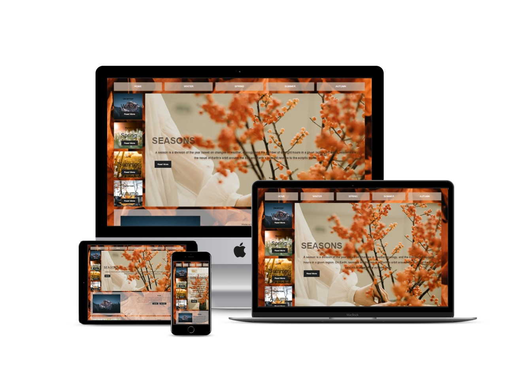

# Seasons :smile:

<!-- ABOUT THE PROJECT -->

## About The Project
### fully Responsive
***What I use :thinking: :*** 
- HTML 
- CSS
- HTML 5
- CSS 3
- Mockup

[Click Here](https://ranamaj.github.io/Seasons/)

(<a href="#top">back to top</a>)

